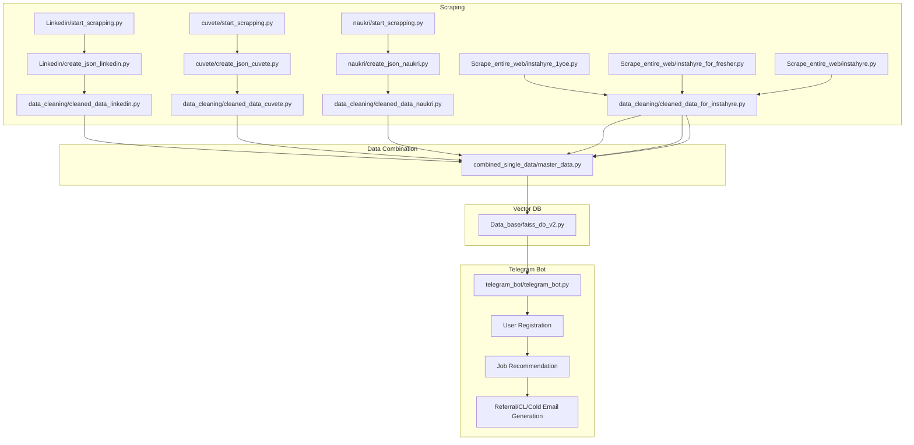

# JOB.ai

## Overview

JOB.ai is an automated job aggregation and recommendation platform designed to streamline the job search and application process. It scrapes job listings from multiple sources, cleans and merges the data, builds a semantic vector database for efficient search, and interacts with users via a Telegram bot to deliver personalized job recommendations and application support.

---

https://github.com/user-attachments/assets/2710f98f-7da0-4ffd-a5e9-6dcf949f2810


## Architecture & Workflow

The JOB.ai system is modular and highly automated. Below is a detailed breakdown of each stage in the workflow:

### 1. Scraping Job Data (Parallel Execution)

**Sources:**
- **Linkedin**
- **Cuvete**
- **Naukri**
- **Instahyre & Entire Web**


**Process:**
- Each source has its own scraping script (`start_scrapping.py`) that collects raw job data.
- The raw data is converted to JSON format for consistency (`create_json_*.py`).
- Data cleaning scripts (`data_cleaning/cleaned_data_*.py`) standardize and sanitize the job listings, removing duplicates and formatting fields.

**Parallelization:**  
All scrapers can be run simultaneously to maximize throughput and minimize latency.

---

### 2. Data Combination

- The cleaned datasets from all sources are merged using `combined_single_data/master_data.py`.
- This step ensures a unified schema and removes any remaining duplicates.
- The master data file imports and utilizes helper scripts for efficient merging and transformation.

---

### 3. Semantic Vector Database

- The merged dataset is indexed using FAISS (`Data_base/faiss_db_v2.py`), a high-performance vector database.
- This enables fast, semantic search and matching of jobs to user profiles and queries.

---

### 4. Telegram Bot Interaction

- The Telegram bot (`telegram_bot/telegram_bot.py`) is the user-facing component.
- **Registration:** Users provide their name, phone, email, years of experience, and upload their CV (PDF).
- **Job Recommendations:** The bot sends jobs in batches, with a "Send More Jobs" button for pagination.
- **Application Support:** For each job, users can request:
  - Referral mail
  - Cover letter
  - Cold email template
- **Data Storage:** All user data and job recommendations are stored in MongoDB for persistence and analytics.

---

## Workflow Diagram



---

## Telegram Bot Features

- **User Registration:** Collects user details and CV for personalized recommendations.
- **Job Recommendations:** Sends jobs in batches, supports pagination.
- **Application Support:** Generates referral mails, cover letters, and cold emails tailored to each job.
- **Persistence:** All user interactions and recommendations are stored in MongoDB.

---

## Setup Instructions

1. **Clone the repository** and navigate to the project directory.
2. **Install dependencies**:
    ```sh
    pip install -r requirements.txt
    ```
3. **Set up environment variables** in `.env`:
    ```
    TOKEN=your_telegram_bot_token
    MONGO_DB_URI=your_mongodb_uri
    ```
4. **Run the workflow steps** as described above.

---

## File Structure

- `Linkedin/`, `cuvete/`, `naukri/`, `Scrape_entire_web/`: Scrapers and raw data.
- `data_cleaning/`: Data cleaning scripts.
- `combined_single_data/`: Data merging scripts.
- `Data_base/`: Database and vector store scripts.
- `telegram_bot/`: Telegram bot source code.
- `resume_cold_mail/`: Resume parsing and mail generation.

---

## Notes

- Ensure MongoDB is running and accessible.
- The Telegram bot requires a valid bot token.
- All scripts should be run in the specified order for correct data flow.
- For production, consider using process managers (e.g., supervisord, systemd) and Docker for deployment.

---

## License

See [LICENSE](LICENSE) for details.
